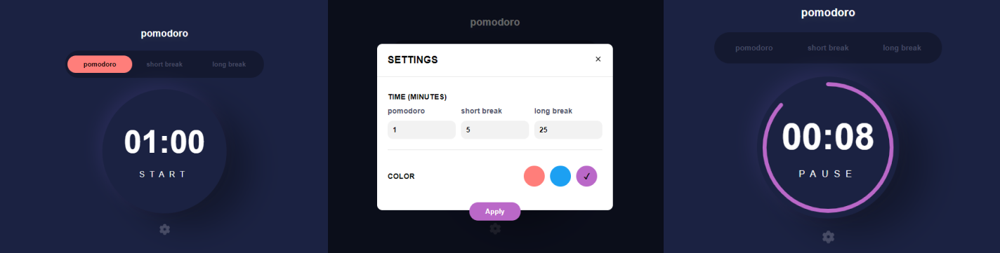

<p align="center">
    
</p>

Pomodo application [challenge](https://www.frontendmentor.io/challenges/pomodoro-app-KBFnycJ6G) of frontend mentors using React technologies and backend technologies.


* [Overview](#Overview:)
* [Installation](#Installation:)
* [Technologies](#Technologies:)
* [Features](#Features:)


# Overview
⏰ Pomodoro web app using a monorepo system. The main feature is define a timer to help you focus on your activities.

View demo [https://jhony-24.github.io/pomodoro-app/](https://jhony-24.github.io/pomodoro-app/)



# Installation:
To use in local server you can run the next commands:

* Install dependencies using the next command
  ```bash
  $ npm run packages:install
  ```
* If you want to run the api service create the next files or ignore this step:
  ```bash
  // Navigate to api package and create a .env file, inside create a env value

  MONGO_URL=mongodb://localhost:27017/pomodoro
  ```  
* Running the application package:
  ```bash
  $ npm run app:dev
  ```
* Running the api package:
  ```bash
  $ npm run api:dev
  ```


# Technologies:
* **React**: [https://reactjs.org/](https://reactjs.org/)
* **Effector**: [https://effector.dev/](https://effector.dev/)
* **Stitches**: [https://stitches.dev/](https://stitches.dev/)
* **Express**: [https://expressjs.com/](https://expressjs.com/)
* **MongoDB**: [https://www.mongodb.com/](https://www.mongodb.com/)

# Features:
* Set a Pomodoro timer and short & long break timers
* Customize how long each timer runs for
* See a circular progress bar that updates every minute and represents how far through their timer they are
* Customize the appearance of the app with the ability to set preferences for colors
* (Local) Create custom timers with description and custom colors